# CareerFlow — AI Pipeline: Every Model & Library Named

---

## 🔵 CV Pipeline — Upload → Score → Feedback

```mermaid
flowchart TD
    A["POST /api/cv/upload/"] --> B["Validate file\nPDF / DOCX ≤10MB"]
    B --> C["Deactivate old CVs\nCreate CandidateCV in DB"]
    C --> D["Audit log → DataAccessLog"]
    D --> E["CVExtractionPipeline.process_candidate_cv()"]

    subgraph STEP1 ["STEP 1 — Text Extraction  (text_extractor.py)"]
        E --> F1{"File type?"}
        F1 -- PDF --> F2["📦 pdfplumber\n(pdfplumber.open → page.extract_text)\nLibrary: pdfplumber"]
        F1 -- DOCX/DOC --> F3["📦 python-docx\n(docx.Document → paragraphs + tables)\nLibrary: python-docx"]
        F2 --> F4["clean_extracted_text()\nPure Python regex sanitizer\nNo ML model — deterministic"]
        F3 --> F4
        F4 --> F5["raw_text string"]
    end

    subgraph STEP2 ["STEP 2 — Skills Extraction  (skill_extractor.py)"]
        F5 --> G1["SkillExtractor.extract_skills(raw_text)\nMethod: keyword lookup against\nJSON taxonomy file:\n'data/skills_taxonomy.json'\n+ CANONICAL_ALIASES dict\nNo ML model — pure string matching"]
        G1 --> G2["skills: List[str]"]
    end

    subgraph STEP3 ["STEP 3 — Entity Extraction  (entity_extractor.py)"]
        F5 --> H1["extract_entities(raw_text)\nMethod: compiled regex patterns\n- DEGREE_PATTERNS (BSc, MSc, PhD…)\n- TITLE_KEYWORDS (job titles)\n- INSTITUTION_KEYWORDS (university, college…)\n- KNOWN_INSTITUTIONS list (BUET, NSU, MIT…)\nNo ML model — pure regex"]
        H1 --> H2["education: List[dict]\nexperience: List[dict]"]
    end

    G2 --> I["Store ParsedCV in DB\n(raw_text, skills, education, experience)"]
    H2 --> I

    subgraph STEP4 ["STEP 4 — Rubric Scoring  (scorer.py → CVScorer)"]
        I --> J1["detect_role_profile()\nKeyword scan → label:\nfrontend / backend / fullstack /\ndevops / data_science / mobile / data_engineering\nNo ML — pure string search"]
        J1 --> J2["evaluate_formatting()\nRegex section detection\n+ word count + paragraph density\n📐 Weight: 20%"]
        J1 --> J3["evaluate_keywords()\nACTION_VERBS list (75 verbs)\n+ WEAK_PHRASE_PATTERNS regex\n+ Role-specific ROLE_PROFILES bonus\n📐 Weight: 30%"]
        J1 --> J4["evaluate_clarity_and_impact()\nRegex: % / $ / multipliers /\nmagnitude numbers / metric phrases\n📐 Weight: 30%"]
        J1 --> J5["evaluate_experience_and_education()\nCount experience + education records\n📐 Weight: 10% + 10%"]
        J2 & J3 & J4 & J5 --> J6["calculate_composite_score()\n= 0.20·fmt + 0.30·kw + 0.30·clarity\n  + 0.10·exp + 0.10·edu\n→ overall_score /100\nNo ML — deterministic formula"]
    end

    subgraph STEP5 ["STEP 5 — Suggestions  (gemini_suggestions.py)"]
        J6 --> K1["Rule-based engine\ngenerate_suggestions()\nPriority list 1-23 → top 3\nNo ML — conditional logic"]
        K1 --> K2{"GEMINI_API_KEY\nconfigured?"}
        K2 -- Yes --> K3["🤖 Google Gemini API\nTry models in order:\n1. gemini-3.5-flash-lite  ← default\n2. gemini-3.5-flash\n3. gemini-3.1-flash-lite\n4. gemini-3-flash-preview\n5. gemini-3.8-flash\n\nInput: scores + CV excerpt (≤2200 chars)\nOutput: 3 plain-text suggestions"]
        K2 -- No --> K4["Use rule-based suggestions"]
        K3 -- "≥2 suggestions returned" --> K5["Use Gemini suggestions\nsource = 'gemini'"]
        K3 -- "fail / <2 results" --> K4
        K4 --> K5
    end

    K5 --> L["Save CVFeedback to DB\n(5 sub-scores, suggestions, signal_breakdown)"]
    L --> M["Return 201 to frontend"]
```



### CV Score Weights
| Dimension | Weight | What it measures |
|---|---|---|
| Formatting | **20%** | Section presence, word count, paragraph density |
| Keyword Strength | **30%** | Skills count + action verbs − weak phrases |
| Clarity & Impact | **30%** | Numeric metrics (%, $, multipliers), bullet count |
| Experience | **10%** | Number of extracted job records |
| Education | **10%** | Number & richness of degree records |

### CV Gemini Prompt Strategy
- **Input sent:** all 5 scores, role profile, detected skills, weak phrases, weak bullet examples, rule-based hints, first 2200 chars of CV text
- **Output asked for:** exactly 3 plain-text, second-person, CV-grounded suggestions (no numbering, no bullets)
- **Fallback chain:** `gemini-3.5-flash-lite` → `gemini-3.5-flash` → `gemini-3.1-flash-lite` → `gemini-3-flash-preview` → `gemini-3.8-flash`

---

## 🟠 Presentation Pipeline — Upload → Score → Feedback

```mermaid
flowchart TD
    A2["POST /api/presentation/upload/"] --> B2["Validate file\nMP4/WebM/MOV ≤250MB"]
    B2 --> C2["Write raw file → temp_uploads/ (staging)"]

    subgraph PRE ["PRE-PROCESSING — video_compressor.py + validators.py"]
        C2 --> D2["🛠️ FFprobe (from FFmpeg suite)\nprobe_video_duration()\nExtract video metadata\nTool: FFmpeg/FFprobe CLI"]
        D2 --> E2["Duration check ≤ 180s (3 min)"]
        E2 --> F2["🛠️ FFmpeg compress_video()\nCommand: ffmpeg -vf scale=1280:720\n-c:v libx264 -crf 26 -preset fast\n→ 720p H.264 MP4 <50MB\nTool: FFmpeg CLI"]
        F2 --> G2["Delete raw staging file\nSave PresentationVideo\nstatus = READY_FOR_ANALYSIS"]
    end

    G2 --> H2["POST /api/presentation/{id}/analyze/\nTriggers PipelineManager.run_pipeline(video)"]

    subgraph S1 ["STAGE 1 — Speech Analysis  (speech_analyzer.py)"]
        H2 --> I1["status = PROCESSING_SPEECH"]
        I1 --> I2["🛠️ FFmpeg audio_extractor.py\nExtract 16kHz mono PCM WAV\nCommand: ffmpeg -ar 16000 -ac 1 -c:a pcm_s16le\nTool: FFmpeg CLI"]
        I2 --> I3["🤖 faster-whisper WhisperModel\nFasterWhisperTranscriptionService\nModel size: 'base'\nDevice: CPU\nCompute type: int8 (CTranslate2 quantized)\nLibrary: faster-whisper\nSettings: beam_size=5, vad_filter=True,\n  min_silence_duration_ms=500\n→ transcript text + duration + segments"]
        I3 --> I4["speech_metrics.py\ncount_words() — str.split()\ncalculate_wpm() — words/duration×60\ndetect_filler_words() — keyword list\n(um, uh, like, you know, so, actually…)\ncalculate_clarity_score() — formula\nNo ML — pure math"]
        I4 --> I5["Save SpeechAnalysis to DB"]
    end

    subgraph S2 ["STAGE 2 — Behavioral Analysis  (behavioral_analyzer.py)"]
        I5 --> J1["status = PROCESSING_VISION"]
        J1 --> J2["🛠️ OpenCV (cv2)\nVideoCapture → frame extraction\nSample rate: 3 FPS\nLibrary: opencv-python"]
        J2 --> J3["🤖 MediaPipe FaceMesh\nmp.solutions.face_mesh.FaceMesh\nSettings:\n  max_num_faces=1\n  refine_landmarks=True  ← iris tracking\n  min_detection_confidence=0.5\n  min_tracking_confidence=0.5\n468 facial landmarks → eye/iris coords\nLibrary: mediapipe"]
        J2 --> J4["🤖 MediaPipe Pose\nmp.solutions.pose.Pose\nSettings:\n  model_complexity=1  ← Full model\n  smooth_landmarks=True\n  min_detection_confidence=0.5\n  min_tracking_confidence=0.5\n33 body landmarks → shoulders/nose\nLibrary: mediapipe"]
        J3 --> J5["behavioral_metrics.py\ncompute_eye_aspect_ratio()\ncompute_iris_horizontal_ratio()\nis_eye_contact_frame()\ncalculate_shoulder_tilt_angle()\ncheck_is_slouched()\ncalculate_facial_engagement()\n→ eye_contact_score, posture_score,\n  engagement_score\nNo ML — pure geometry math"]
        J4 --> J5
        J5 --> J6["Save BehavioralAnalysis to DB"]
        J1 -- "Vision fails\n(dark video/face not found)" --> J7["⚠️ GRACEFUL DEGRADATION\nLog DEGRADED status\nScore will be 100% speech-based\nstatus = PARTIALLY_COMPLETED"]
    end

    subgraph S3 ["STAGE 3 — Composite Scoring  (scorer.py)"]
        J6 --> K1["status = SCORING"]
        J7 --> K1
        K1 --> K2["PresentationScorer.evaluate(speech, behavioral)"]
        K2 --> K3["pace_score\nIdeal WPM range: 130–160\nPenalty: 1pt per WPM deviation\nFormula only — no ML"]
        K2 --> K4["filler_score\nPenalty: 5pts per filler word\nFormula only — no ML"]
        K3 & K4 --> K5["speech_score\n= 0.50 × pace_score\n+ 0.50 × filler_score"]
        K2 --> K6["behavioral_score\n= 0.40 × eye_contact\n+ 0.30 × posture\n+ 0.30 × engagement"]
        K5 & K6 --> K7{"Has behavioral\ndata?"}
        K7 -- Yes --> K8["overall_score\n= 0.50 × speech\n+ 0.50 × behavioral"]
        K7 -- No --> K9["overall_score = speech_score\n(degraded mode, 100% speech)"]
        K8 --> K10["Save PresentationScore to DB"]
        K9 --> K10
    end

    subgraph S4 ["STAGE 4 — AI Coaching  (llm_coach_service.py)"]
        K10 --> L1["GeminiPresentationCoachService\n.generate_feedback(metrics)"]
        L1 --> L2{"GEMINI_API_KEY\nconfigured?"}
        L2 -- Yes --> L3["🤖 Google Gemini API\nTry models in order:\n1. gemini-3.5-flash-lite  ← default\n2. gemini-3.5-flash\n3. gemini-3.1-flash-lite\n4. gemini-3.8-flash\n\nConfig:\n  system_instruction = PRESENTATION_COACH_SYSTEM_PROMPT\n  response_mime_type = 'application/json'\n  temperature = 0.3\n\nInput: WPM, filler count/breakdown,\n  eye_contact, posture, engagement,\n  overall/pace/filler scores, transcript,\n  duration_seconds\nOutput JSON:\n  { summary, strengths[],\n    critical_improvements[],\n    practice_script_tip }"]
        L2 -- No --> L4["Rule-based fallback\ngenerate_rule_based_fallback()\nThreshold-based severity scoring\nNo ML"]
        L3 -- "Valid JSON parsed" --> L5["Save PresentationFeedback to DB"]
        L3 -- "Fail / invalid JSON" --> L4
        L4 --> L5
    end

    L5 --> M2["Final status:\nCOMPLETED or PARTIALLY_COMPLETED"]
    M2 --> N2["Return pipeline results to frontend"]
```



### Presentation Score Weights
| Component | Weight | Sub-components |
|---|---|---|
| Speech Score | **50%** | Pace (50%) + Filler control (50%) |
| Behavioral Score | **50%** | Eye contact (40%) + Posture (30%) + Engagement (30%) |

> **Important:** If MediaPipe fails (dark lighting, face not visible), the pipeline **does NOT crash**. It gracefully degrades: `overall_score = speech_score` (100% weight), `status = PARTIALLY_COMPLETED`.

### Presentation Gemini Prompt Strategy
- **Mode:** strict JSON (`response_mime_type="application/json"`, `temperature=0.3`)
- **System prompt:** expert presentation coach persona
- **Returns structured object:** `{ summary, strengths[], critical_improvements[{ category, observation, actionable_drill }], practice_script_tip }`
- **Fallback:** `generate_rule_based_fallback()` if Gemini unavailable

---

## 📋 Master Model & Library Reference

| Pipeline | Stage | Tool / Model | Library / Binary | What it does |
|---|---|---|---|---|
| **CV** | Text extraction (PDF) | **pdfplumber** | `pdfplumber` PyPI | Parses PDF pages → raw text |
| **CV** | Text extraction (DOCX) | **python-docx** | `python-docx` PyPI | Parses Word paragraphs + tables |
| **CV** | Skills extraction | **skills_taxonomy.json** + keyword matcher | Pure Python (no ML) | Looks up 500+ tech terms in JSON dict |
| **CV** | Entity extraction | **Regex engine** (compiled patterns) | Pure Python `re` | Detects degrees, job titles, institutions |
| **CV** | Scoring | **CVScorer rubric** (formula) | Pure Python math | 5-dimension weighted score |
| **CV** | Suggestions | **Rule-based engine** (priority list 1–23) | Pure Python | Top-3 suggestions by weakness priority |
| **CV** | AI suggestions | **Google Gemini API** | `google-genai` PyPI | Generates CV-specific suggestions |
| **CV** | Gemini model #1 | `gemini-3.5-flash-lite` | Google Gemini | Default — tried first |
| **CV** | Gemini model #2 | `gemini-3.5-flash` | Google Gemini | 2nd fallback |
| **CV** | Gemini model #3 | `gemini-3.1-flash-lite` | Google Gemini | 3rd fallback |
| **CV** | Gemini model #4 | `gemini-3-flash-preview` | Google Gemini | 4th fallback |
| **CV** | Gemini model #5 | `gemini-3.8-flash` | Google Gemini | Last fallback |
| **Presentation** | Video compression | **FFmpeg** (`libx264`, CRF 26, 720p) | FFmpeg CLI | Compresses raw video to <50MB MP4 |
| **Presentation** | Duration probe | **FFprobe** | FFmpeg CLI | Reads video metadata |
| **Presentation** | Audio extraction | **FFmpeg** (16kHz mono WAV, `pcm_s16le`) | FFmpeg CLI | Strips audio for Whisper |
| **Presentation** | Speech-to-text | **faster-whisper `WhisperModel` `base`** | `faster-whisper` PyPI (CTranslate2) | Transcribes speech → text |
| **Presentation** | Whisper device | **CPU** with **int8** quantization | CTranslate2 | Optimised for no-GPU servers |
| **Presentation** | Whisper VAD | **Silero VAD** (built into faster-whisper) | included | Filters silent segments automatically |
| **Presentation** | Frame extraction | **OpenCV `VideoCapture`** | `opencv-python` PyPI | Samples 3 FPS from video |
| **Presentation** | Face landmarks | **MediaPipe FaceMesh** (468 landmarks, iris tracking) | `mediapipe` PyPI | Eye contact detection |
| **Presentation** | Body landmarks | **MediaPipe Pose** (33 landmarks, complexity=1) | `mediapipe` PyPI | Posture / shoulder tilt |
| **Presentation** | Behavioral scoring | **Geometry formula** (EAR, iris ratio, shoulder angle) | Pure Python math | Converts landmarks → 0-100 scores |
| **Presentation** | Composite scoring | **PresentationScorer formula** | Pure Python math | Weighted speech + behavioral |
| **Presentation** | AI coaching | **Google Gemini API** (JSON mode, temp=0.3) | `google-genai` PyPI | Structured coaching feedback |
| **Presentation** | Gemini model #1 | `gemini-3.5-flash-lite` | Google Gemini | Default — tried first |
| **Presentation** | Gemini model #2 | `gemini-3.5-flash` | Google Gemini | 2nd fallback |
| **Presentation** | Gemini model #3 | `gemini-3.1-flash-lite` | Google Gemini | 3rd fallback |
| **Presentation** | Gemini model #4 | `gemini-3.8-flash` | Google Gemini | Last fallback |

---

## ⚙️ How the Rule-Based Suggestion Engines Work

### CV Rule-Based Engine (`scorer.py → generate_suggestions()`)

The engine builds a **priority-ordered candidate list** of suggestion strings, then picks the **top 3** by priority number (lower = more urgent).

```
candidates = List[ (priority_int, suggestion_string) ]
```

**How each category is evaluated:**

| Priority | Trigger condition | Example suggestion generated |
|---|---|---|
| 1 | `metrics_count == 0` AND weak bullets exist | Quote the actual weak bullet → show how to rewrite with a metric |
| 1 | `metrics_count == 0` AND no bullets | Generic: "Quantify your results with measurable %" |
| 2 | `weak_phrases_found` (e.g. "responsible for") | Lists the exact phrases found, suggests strong action verbs |
| 3 | `metrics_count < 3` | "You have N metric(s) — aim for 4-6. Start with: [actual bullet]" |
| 4 | `skills_count < 5` | "Only N skills detected. Expand Skills section." |
| 5 | `action_verb_diversity < 3` | "Only N unique action verbs. Use: Engineered, Optimized, Delivered…" |
| 6 | `skills_count < 8` | Softer nudge to add more domain tools |
| 7 | `action_verb_diversity < 5` | "Aim for 6+ unique action verbs" |
| 8 | `'experience'` in `missing_sections` | "Add a Work Experience / Projects section heading" |
| 9 | `'skills'` in `missing_sections` | "Add a Technical Skills section, grouped by category" |
| 10 | `'education'` in `missing_sections` | "Add an Education section with degree, institution, year" |
| 11 | `'summary'` in `missing_sections` | "Add a 2-3 line professional summary at the top" |
| 12 | `'contact'` in `missing_sections` | "Add email, phone, LinkedIn, GitHub at the top" |
| 13 | `has_dense_paragraphs == True` | "Break blocks >150 words into bullet points" |
| 14 | `word_count < 150` | "Your CV is brief (N words). Expand with project detail." |
| 15 | `experience_count == 0` | "Detail your recent roles with company, title, dates, bullets" |
| 16 | `education_count == 0` | "Specify degree title, major, university name, graduation year" |
| 17 | `role_profile` detected | "Your CV targets [Role]. Include: [top 5 role-specific skills]" |
| 20–23 | Always included (evergreen) | Tailor to job posting / group skills / lead with best achievement / update GitHub |

**Final selection:**
```python
candidates.sort(key=lambda x: x[0])   # sort by priority number ascending
selected = deduplicated top 3          # pick first 3 unique suggestions
```

The rule-based suggestions are **always generated first**, then passed to Gemini as `rule_based_hints` context so Gemini can reference them without copying verbatim.

> **Note — Content-aware suggestions:** where possible, the engine references actual CV content. For example, if a weak bullet is found (`"Responsible for building the API…"`), it is **quoted in the suggestion** so the candidate knows exactly which line to fix.

---

### Presentation Rule-Based Fallback (`llm_coach_service.py → generate_rule_based_fallback()`)

The presentation fallback uses a **severity scoring system** — each weakness gets a numeric severity, all weaknesses are sorted highest severity first, and up to 3 are returned as `critical_improvements`.

**Step 1 — Evaluate each dimension and assign severity:**

```
severity = how far the metric is from its threshold
```

| Dimension | Threshold | Severity formula | Drill given |
|---|---|---|---|
| **Pacing (too slow)** | WPM < 130 | `severity = 130 - wpm` | "60-Second Sprint" read-aloud drill |
| **Pacing (too fast)** | WPM > 160 | `severity = wpm - 160` | "Comma-Breathe" pause drill |
| **Filler words** | `filler_count > 2` | `severity = filler_count × 8` | "Silent Pause Pivot" drill |
| **Eye contact** | `eye_contact < 75%` | `severity = (75 - eye_contact) × 1.5` | "Sticky Note Cue" drill |
| **Posture** | `posture < 80` | `severity = 80 - posture` | "Shoulder-Roll Reset" drill |

**Step 2 — Sort by severity descending** (biggest weakness first):
```python
improvement_candidates.sort(key=lambda x: x[0], reverse=True)
improvements = [item[1] for item in improvement_candidates][:3]
```

**Step 3 — Build strengths list** (anything that met its threshold gets a positive sentence):
- WPM 130–160 → "Optimal speaking pace at X WPM…"
- filler_count ≤ 2 → "Outstanding vocal economy with only N filler words…"
- eye_contact ≥ 75 → "Strong camera engagement with X% direct gaze…"
- posture ≥ 80 → "Solid posture stability (X/100)…"
- Minimum 2 strengths enforced — falls back to engagement score if needed

**Step 4 — Build summary** based on `overall_score`:

| Score range | Grade label | Summary tone |
|---|---|---|
| ≥ 85 | Excellent | "Outstanding presentation… commands strong executive presence" |
| 70–84 | Competent | "Solid baseline… addressing your primary focal area will rapidly elevate impact" |
| < 70 | Needs Practice | "Focusing on camera eye contact and vocal delivery will significantly boost confidence" |

**Step 5 — Generate `practice_script_tip`** from actual transcript:
- Splits the first sentence of the real transcript at a comma
- Inserts a `[1-sec pause]` marker: `"Good morning… [1-sec pause] I'm here to discuss…"`
- If no transcript: uses a stock interview opener

**Output structure:**
```json
{
  "summary": "Solid presentation baseline scoring 74/100...",
  "strengths": ["Optimal speaking pace at 145 WPM...", "Strong camera engagement with 81%..."],
  "critical_improvements": [
    {
      "category": "Filler Words",
      "observation": "Detected 7 filler occurrences (um: 4, like: 3)...",
      "actionable_drill": "The Silent Pause Pivot: keep lips pressed for 1 second instead of saying 'um'."
    }
  ],
  "practice_script_tip": "\"Good morning... [1-sec pause] I am excited to discuss my experience.\""
}
```

---

## 🔑 Key Architecture Differences

| Aspect | CV Pipeline | Presentation Pipeline |
|---|---|---|
| Input | PDF / DOCX | MP4 / WebM / MOV |
| Pre-processing | Text extraction (pdfplumber/docx) | FFmpeg compression to 720p |
| AI signals | Regex + NLP scoring | Whisper STT + MediaPipe CV |
| Scoring engine | `CVScorer` (rubric rules) | `PresentationScorer` (formula) |
| Gemini role | 3 plain-text suggestions | Structured JSON coaching object |
| Gemini output format | Plain text paragraphs | Strict `application/json`, `temp=0.3` |
| Gemini fallback | Rule-based priority list (top 3) | Severity-ranked rule engine (top 3) |
| Fallback references actual content? | ✅ Yes — quotes actual CV bullets | ✅ Yes — quotes actual transcript sentence |
| Graceful degradation | Scanned PDF → empty text warning | Vision failure → speech-only scoring |
| Retry logic | None (synchronous) | `@retry_with_backoff` decorator (exponential + jitter, 2–3 attempts) |
| DB models produced | `ParsedCV`, `CVFeedback` | `SpeechAnalysis`, `BehavioralAnalysis`, `PresentationScore`, `PresentationFeedback`, `PipelineExecutionLog` |

---

## Key Design Principle: "Hybrid Intelligence"

```
Pure deterministic logic  ──────────────────────────────────►  Gemini LLM
(scores, extraction,            Rule-based fallbacks              (suggestions,
 metrics — always fast,          always available                  coaching)
 no API dependency)
```

> **Note:** Scores are NEVER computed by Gemini. All numeric scores (formatting, keyword, clarity, pace, filler, behavioral) are pure Python formulas/regex. Gemini is **only** used for the final human-readable suggestion text — and always has a rule-based fallback if the API is unavailable.
